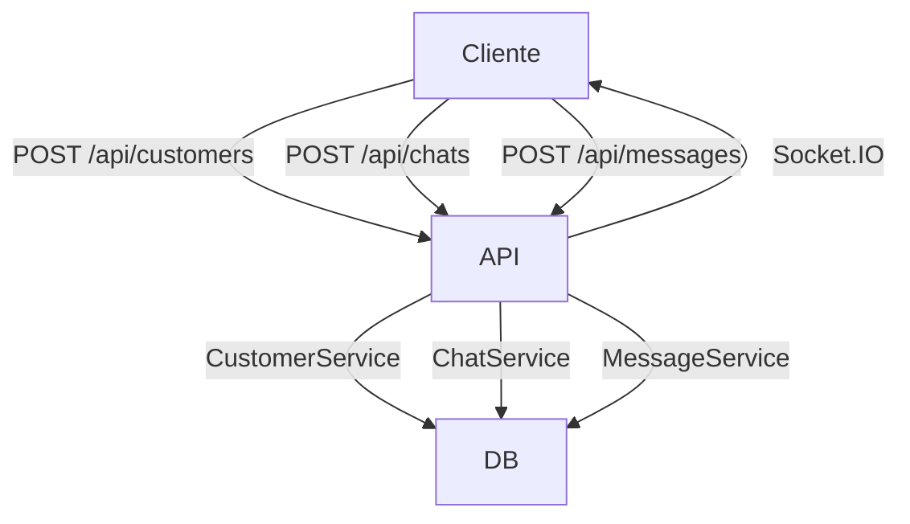

# Documentación Exhaustiva del Backend (Node.js/TypeScript)

## 1. Visión General

Este backend implementa la API y lógica de negocio para el sistema de asesorías KAI. Gestiona clientes, chats, mensajes, logs y comunicación en tiempo real, integrándose con una base de datos MySQL y otros servicios externos.

- **Framework:** Express + TypeScript
- **Persistencia:** MySQL vía TypeORM
- **Comunicación en tiempo real:** Socket.IO
- **Automatización:** node-cron
- **Logging:** Winston + Morgan

---

## 2. Arquitectura y Estructura de Carpetas

```
backend/
├── package.json
├── tsconfig.json
├── db_conectionTest.ts
├── logs/
├── node_modules/
└── src/
    ├── main.ts
    ├── adapters/
    │   └── http/
    │       ├── controllers/
    │       │   ├── chat_controller.ts
    │       │   ├── customer_controller.ts
    │       │   ├── message_controller.ts
    │       │   ├── messageStorage_controller.ts
    │       │   └── webhook_controller.ts
    │       └── routes/
    │           ├── chat_routes.ts
    │           ├── customer_routes.ts
    │           ├── message_routes.ts
    │           ├── messageStorage_routes.ts
    │           └── webhook_routes.ts
    ├── application/
    │   └── services/
    │       ├── chat_service.ts
    │       ├── customer_service.ts
    │       ├── message_service.ts
    │       ├── messageStorage_service.ts
    │       └── pythonCommunication.ts
    ├── config/
    │   ├── data_source.ts
    │   └── socket.ts
    ├── cron/
    │   └── inactiveChatCron.ts
    ├── domain/
    │   └── entities/
    │       ├── chat_entity.ts
    │       ├── customer_entity.ts
    │       ├── message_entity.ts
    │       ├── messageStorage_entity.ts
    │       └── summary_entity.ts
    ├── handleUtils/
    │   ├── apiResponse.ts
    │   └── logger.ts
    ├── infrastructure/
    │   └── repositories/
    │       ├── chat_repository.ts
    │       ├── customer_repository.ts
    │       ├── message_repository.ts
    │       ├── messageStorage_repository.ts
    │       └── summary_repository.ts
    ├── middlewares/
    │   └── errorHandleMiddleware.ts
    ├── scripts/
    │   ├── test_client.ts
    │   └── test_summary.ts
    └── sql/
        ├── kai_dataTest.sql
        └── kai_structure.sql
```

---

## 3. Descripción de Carpetas y Archivos

### 3.1 main.ts
- **Punto de entrada**. Inicializa Express, middlewares, rutas, servidor HTTP y Socket.IO. Lanza el cron de cierre automático de chats inactivos y conecta a la base de datos.

### 3.2 adapters/http/controllers/
- **chat_controller.ts**: CRUD y gestión de chats. Endpoints: `/api/chats`.
- **customer_controller.ts**: CRUD y gestión de clientes. Endpoints: `/api/customers`.
- **message_controller.ts**: CRUD y gestión de mensajes. Endpoints: `/api/messages`.
- **messageStorage_controller.ts**: Logs y respaldo de mensajes. Endpoints: `/api/message-storage`.
- **webhook_controller.ts**: Recepción de eventos externos. Endpoints: `/webhook`.

### 3.3 adapters/http/routes/
- Define las rutas y asocia cada endpoint con su controlador.

### 3.4 application/services/
- **chat_service.ts**: Lógica de negocio para chats.
- **customer_service.ts**: Lógica de negocio para clientes.
- **message_service.ts**: Lógica de negocio para mensajes.
- **messageStorage_service.ts**: Lógica de negocio para logs de mensajes.
- **pythonCommunication.ts**: Comunicación con backend Python (IA).

### 3.5 domain/entities/
- Modelos de datos (TypeORM) para cada tabla: chat, customer, message, messageStorage, summary.

### 3.6 infrastructure/repositories/
- Acceso a datos y persistencia para cada entidad.

### 3.7 handleUtils/
- **apiResponse.ts**: Respuestas API estandarizadas.
- **logger.ts**: Configuración de logs con Winston.

### 3.8 middlewares/
- **errorHandleMiddleware.ts**: Manejo centralizado de errores.

### 3.9 scripts/
- **test_client.ts**: Prueba de conexión vía socket.
- **test_summary.ts**: Prueba de generación de resumen.

### 3.10 sql/
- **kai_dataTest.sql**: Datos ficticios para pruebas.
- **kai_structure.sql**: Estructura de la base de datos.

### 3.11 config/
- **data_source.ts**: Configuración de TypeORM y conexión a MySQL.
- **socket.ts**: Configuración de Socket.IO.

### 3.12 cron/
- **inactiveChatCron.ts**: Cierra automáticamente chats inactivos.

---

## 4. Procesos Principales y Flujos

### 4.1 Gestión de Chats
- Crear chat si no existe para un cliente.
- Actualizar estado (activo/inactivo).
- Listar y eliminar chats.

### 4.2 Gestión de Clientes
- Crear o recuperar cliente por nombre/teléfono.
- Actualizar y eliminar clientes.
- Buscar por ID o teléfono.

### 4.3 Gestión de Mensajes
- Crear mensajes asociados a un chat y cliente.
- Obtener historial de mensajes.
- Eliminar mensajes.

### 4.4 Logs y Respaldo
- Guardar logs de mensajes para auditoría y respaldo.

### 4.5 Webhooks
- Recibir eventos externos para integración con otros sistemas.

### 4.6 Comunicación en Tiempo Real
- Socket.IO permite notificaciones y actualizaciones en tiempo real a los clientes conectados.

### 4.7 Automatizaciones
- Cron para cierre automático de chats inactivos.

---

## 5. Endpoints Principales (Resumen)

| Recurso           | Ruta Base           | Acciones Disponibles                        |
|-------------------|---------------------|---------------------------------------------|
| Customers         | /api/customers      | CRUD y búsqueda por teléfono o ID           |
| Chats             | /api/chats          | Crear, actualizar, finalizar sesión         |
| Messages          | /api/messages       | Crear mensaje, obtener historial            |
| MessageStorage    | /api/message-storage| Logs y respaldo de mensajes                 |
| Webhook           | /webhook            | Recepción de eventos externos               |

> **Nota:** Ver los archivos de rutas y controladores para detalles de cada endpoint, parámetros y respuestas.

---

## 6. Dependencias y Configuración

- **TypeORM**: ORM para MySQL.
- **Socket.IO**: Comunicación en tiempo real.
- **Winston**: Logging.
- **dotenv**: Variables de entorno.
- **node-cron**: Tareas programadas.
- **Express**: Framework principal.
- **Morgan**: Logs HTTP.
- **uuid**: Generación de IDs únicos.

### Variables de entorno típicas:
```env
DB_HOST=...
DB_USER=...
DB_PASSWORD=...
DB_NAME=...
DB_PORT=3306
```

---

## 7. Scripts y Pruebas

- `npm run main`: Inicia el backend.
- `npm run test_client`: Prueba conexión socket.
- `npm run test_summary`: Prueba generación de resumen.

---

## 8. Buenas Prácticas y Recomendaciones

- Separación clara entre controladores, servicios, repositorios y entidades.
- Manejo centralizado de errores.
- Respuestas API estandarizadas.
- Uso de middlewares para logging y parsing.
- Automatización de tareas críticas (cron).
- Uso de TypeScript para tipado fuerte y mantenibilidad.

---

## 9. Ejemplo de Flujo de Datos (Chat)



---

## 10. Ejemplo de Request/Response

### Crear cliente
**POST** `/api/customers`
```json
{
  "name": "Juan Pérez",
  "phone": "3001234567",
  "company": "EmpresaX",
  "rol": "Gerente"
}
```
**Respuesta:**
```json
{
  "success": true,
  "message": "Cliente obtenido o creado correctamente",
  "data": {
    "id": 1,
    "name": "Juan Pérez",
    "phone": "3001234567",
    "company": "EmpresaX",
    "rol": "Gerente"
  }
}
```

### Crear chat
**POST** `/api/chats`
```json
{
  "id_customer": 1
}
```
**Respuesta:**
```json
{
  "success": true,
  "message": "Chat obtenido o creado correctamente",
  "data": {
    "id": 1,
    "id_customer": 1,
    "state": 1
  }
}
```

**Última actualización:** 8 de junio de 2024